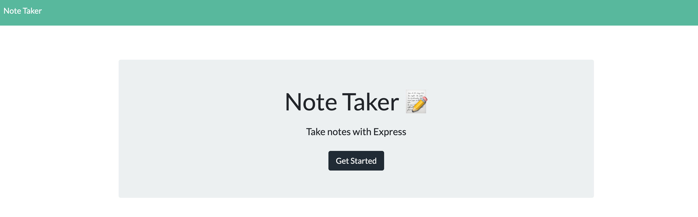
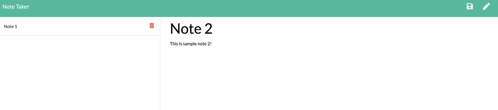

# note-taker
About the project:

Application to take note. 

Image preview:

Index page

Note Page 

Description of project:

-Semantic HTML elements are used.

-Structures are in logical structures in positioning and styling.

-Bootstrap grid system used for responsive layout.

-Javascript used

-Node.js
    
    -path
    -fs

-NPM
    
    -express

Deployed Link on Heroku:

https://jb-note-taker-app.herokuapp.com
